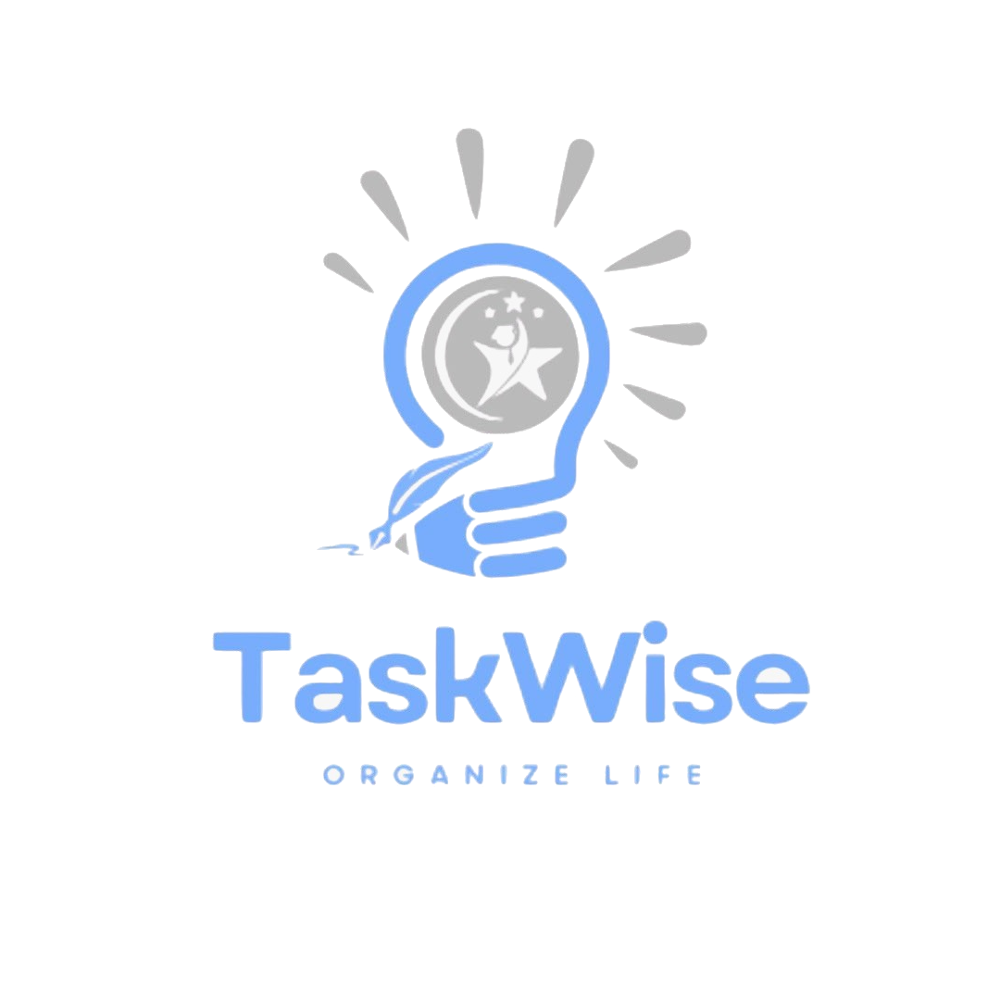

# TaskWise

## Description

TaskWise is a versatile reminder app designed to keep users organized and on track. Users can easily add tasks by specifying a title, description, and the exact date they want to be reminded. The app also features a dedicated Courses section, allowing users to manage their current courses by adding details such as the course name, code, credits, schedule, and any additional notes. Additionally, TaskWise includes a GPA Calculator to help users efficiently monitor and calculate their academic performance.

## External Link
[Watch Demo Video on YouTube](https://www.youtube.com/watch?v=4iUNDNPPw0g)

## Set Up
- React Native: version 19.0.0
- Visual Studio
- Expo
- Android Studio

## Navigation Structure
| Directory / File      | Description                     |
|-----------------------|---------------------------------|
| **Account**           |                                 |
| ├── ForgotPassword.js | Handles password recovery       |
| ├── Login.js          | User login functionality        |
| ├── ProfilePage.js    | Displays user profile           |
| └── SignUp.js         | User sign-up functionality      |
| **Calendar**          |                                 |
| ├── EditTask.js       | Edit tasks in the calendar      |
| ├── add.js            | Add tasks to the calendar       |
| └── calendar.js       | Main calendar functionality     |
| **Courses**           |                                 |
| ├── AddCourse.js      | Add new courses                 |
| ├── CourseInfoScreen.js | View detailed course info      |
| ├── CoursesScreen.js  | Display all courses             |
| └── EditCourse.js     | Edit existing courses           |
| **GPA**               |                                 |
| └── GPACalculator.js  | Calculate GPA                   |
| **assets**            |                                 |
| └── Logo.png          | Application logo                |
| App.js                | Main app file                   |
| SplashScreen.js       | Splash screen                   |
| firebaseConfig.js     | Firebase configuration          |
| app.json              | Application configuration       |
| index.js              | Application entry point         |
| package-lock.json     | NPM dependencies (lock file)    |
| package.json          | Project dependencies            |

## Steps
1. **Calendar Page**: Features a stack navigation structure, allowing users to seamlessly navigate to the Add Task page.
2. **Task Page**: Users can input essential details for their reminders, including the title, description, and the date they want to be notified.
3. **Courses Tab**: Features a stack navigation structure, showing users all old and current courses. Users can delete courses by swiping and add new ones via navigation.
4. **Course Info Page**: Displays detailed course information and allows users to edit it.
5. **Add New Course Page**: Users can add new courses by entering details such as course name, code, credit hours, section, schedule, etc.
6.  **GPA Calculator Page**: A simple interface that allows users to input course details, such as course name, grade, and credit hours. Provides the option to switch between grading scales (4.0 or 5.0) based on the system that suits the user's needs and their educational institution's requirements. Includes an "Add Course" button to add course details to the list. Allows users to delete any course from the list using a red delete button next to each course.  
- Features a "Calculate GPA" button that computes:
  - Cumulative GPA based on all courses.   
  - Semester GPA based on the courses for the current semester only. 

## Stack Fold
1. Open your terminal in Visual Studio Code.
2. Run the command `npm install` to install all needed packages.
3. Run the command `npx expo start` to start the Expo development server.
4. Choose one of the following options to run the app:
   - **On a physical device**: Download the Expo Go app on your phone, scan the QR code generated in the terminal, and the app will launch on your device.
   - **Using Android Studio**: In the terminal, press the `A` key to launch the app on the Android emulator. Ensure you have Android Studio installed with a configured virtual device.

## External Information
- Password should be at least 6 characters.

## Future Work

Here are some planned features to expand and improve TaskWise:
- Implement push notifications to remind users of upcoming tasks.
- Allow users to share tasks or courses with others, making it easier for group projects or team planning.
- Expand the GPA calculator to include analytics.
- Add an option for users to set recurring tasks.

## Resources
- [React Native Documentation](https://reactnative.dev/docs/components-and-apis)
